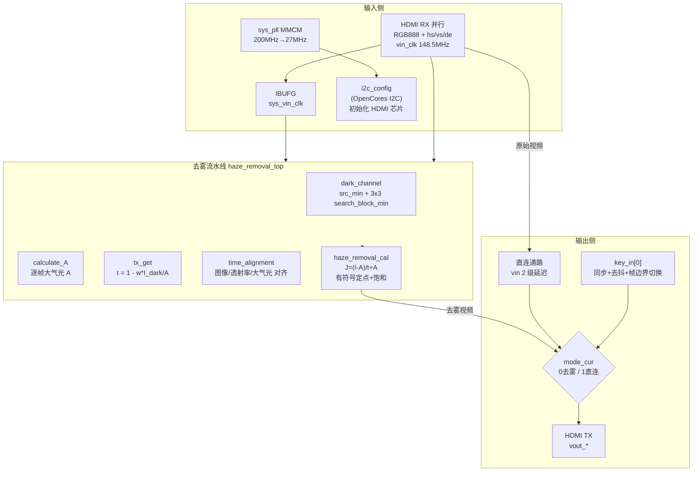

# hdmi_loop —— HDMI 实时暗通道去雾环出工程

## 一、项目简介

本项目在 Xilinx **Artix-7 xc7a200tfbg484-2**(ALINX AX7A200,Vivado 2021.2)上实现一条 **HDMI 输入 → 暗通道先验去雾 → HDMI 输出** 的实时视频环路:

```
外部 HDMI 源 ──▶ HDMI 接收(RX,并行 RGB888 + HS/VS/DE)
              ──▶ 去雾流水线(Y_ENHANCE=0 默认链路)
              ──▶ key_in[0] 一键切换(去雾 / 直连)
              ──▶ HDMI 发送(TX) ──▶ 显示器
```

- 输入/输出均为 **RGB888 并行 + 行场同步/DE**,像素时钟约 **148.5 MHz**(1080p60),顶层把有效行宽配置为 **1920 像素/行**;
- 输入时钟 `vin_clk` 经 IBUFG 得到 `sys_vin_clk`,整条去雾链与输出同步于该时钟;
- 板载按键 **key_in[0]** 可随时在“去雾”与“直连(原图)”之间切换,便于 A/B 对比;
- 去雾算法基于 **暗通道先验 Dark Channel Prior**(何恺明等,CVPR 2009)。

## 二、功能特性

| 特性 | 说明 |
|------|------|
| 实时去雾 | 全流水线,单个像素时钟处理 1 像素,不丢帧 |
| 一键 A/B 对比 | key_in[0] 每按一次在 去雾/直连 间切换,默认去雾 |
| 切换不撕裂 | 新模式只在帧边界(vsync 下降沿)生效 |
| 大气光逐帧更新 | A 按“最近一完整帧”统计并在帧边界锁存,场景变化可跟踪 |
| 定点实现 | 8 bit 像素,透射率/大气光 8 bit,内部有符号 18 bit 定点 + 0..255 饱和 |
| 可配置 Y 增强 | `Y_ENHANCE_ENABLE` 参数控制,YCbCr 亮度增强(默认关闭) |

## 三、算法原理

有雾成像模型:

```
I(x) = J(x)·t(x) + A·(1 − t(x))
```

- I(x):有雾观测图;J(x):待恢复清晰图;t(x):介质透射率;A:全局大气光。

去雾四步:

1. **暗通道** `I_dark(x)`:逐像素取 RGB 三通道最小值(`src_min`),再经 3×3 滑动窗口取最小值(`search_block_min`);
2. **大气光 A** `calculate_A`:统计一帧内“像素三通道最大值”的全局最大,作为大气光(单标量近似);
3. **透射率 t** `tx_get`:`t = 1 − ω·I_dark/A`,ω=0.95(定点 243/256);A 滞后当前帧约一帧;
4. **复原 J** `haze_removal_cal`:`J = (I − A)/max(t, t₀) + A`,t₀ = 26/256 透射率下限。

**定点实现与已修复的数值问题**

- `tx` 以 `tx/256` 表示,下限 `tx_min=26`(防止除零/过曝);
- 复原分子按有符号 18 bit 定点计算:`value_tem = (I−A)·256 + A·tx`。原代码用**无符号 8 bit 减法**求 `I−A`,凡 `I<A`(雾天绝大多数像素)都会回绕成大正数,约七成像素算错;现改为**有符号差分**后再取商;
- 除法结果必须 **0..255 饱和**(天空等亮区商可 >255,暗区可为负),原代码直接截断低 8 位,色彩错误;
- 大气光 A 现**逐帧重置累计**并加下界 1,避免跨帧漂移与全黑帧除零;透射率除法结果加 **0..255 钳位**,防止场景突变(dc>A)时无符号相减回绕。

## 四、系统架构



## 五、时钟与复位结构(顶层 hdmi_loop)

- **200 MHz 差分** `sys_clk_p/n`(R4)→ `sys_pll`(MMCM)输出 27 MHz 供 I2C;
- `locked` 作为全局复位 `rst_n`,并直接驱动三个 HDMI 芯片复位脚(`hdmi_nreset_v10 / hdmi_nreset / hdmi_in_nreset`);
- 输入视频时钟 `vin_clk`(约束 6.734 ns)经 `IBUFG` → `sys_vin_clk`;`vout_clk = sys_vin_clk`(输出跟随输入时钟,无需 TX 侧再锁相);
- `i2c_config_m0`(OpenCores I2C 主机,27 MHz 分频约 7 kHz SCL)上电初始化 HDMI RX/TX 芯片。

## 六、按键模式切换逻辑(顶层新增)

- 极性:**按下 = 低**(key_in[0] 引脚 L19);
- 2 级触发器把按键同步到 `sys_vin_clk`;
- ~14.8 ms 稳定计数去抖(`KEY_STABLE=2_200_000 @148.5MHz`);
- 检测到去抖后的“1→0”按下沿 → 翻转请求模式 `mode_next`;
- 在 **vsync 下降沿(帧边界)** 才把 `mode_next` 落到生效寄存器 `mode_cur`;
- 输出 mux:`vout_* = mode_cur ? 直连(vin_* 2 级延迟) : 去雾(haze_*)`。

默认 `mode_cur=0` = 去雾;`key_in[1..3]` 预留(已在 XDC 定义引脚)。

## 七、模块清单

| 模块 | 位置 | 功能 |
|------|------|------|
| `hdmi_loop` | sources_1/new | 顶层:时钟/复位/I2C/按键切换/输出去雾或直连 |
| `haze_removal_top` | sources_1/darkchannel | 去雾链顶层,generate 选择默认去雾或 Y 增强 |
| `dark_channel` | sources_1/darkchannel | 暗通道顶层(src_min + search_block_min) |
| `src_min` | 同左 | 逐像素 RGB 三通道最小值 |
| `search_block_min` | 同左 | 3×3 窗口最小值(4× sort3) |
| `matrix_generate_3x3` | 同左 | 3×3 滑动窗口寄存器组 |
| `one_column_ram` / `fifo_ram` | 同左 | 两条 1920×8 行缓冲(推断为 2 个 Block RAM) |
| `sort3` | 同左 | 3 个数排序(最大/中值/最小) |
| `calculate_A` | 同左 | 大气光 A:逐帧最大值,帧边界锁存 + 下界 1 |
| `tx_get` | 同左 | 透射率 t = 255 − 243·I_dark/A,结果 0..255 钳位 |
| `time_alignment` | 同左 | 对齐原始图像与 t/A(src 固定延迟 6 拍) |
| `haze_removal_cal` | 同左 | 复原 J:有符号 18 bit 定点 + 0..255 饱和(默认非 IP 分支) |
| `VIP_RGB888_YCbCr444` / `YCbCr2RGB` | 同左 | Y 增强休眠分支(Y_ENHANCE=1)用,默认不综合 |
| `sys_pll` | sources_1/ip | MMCM 时钟 IP |
| `i2c_config` 等 | sources_1/new | OpenCores I2C 配置链 |
| `hdmi_loop.xdc` | constrs_1/new | 管脚约束 + 时钟约束(含 key_in[3:0]) |

## 八、近期修复记录

1. **顶层多驱动清理**:删除残留的 `vin_*_d0/d1/d2` 直通与重复 `assign vout_clk`,`vout_*` 改由去雾模块唯一驱动(否则综合会把去雾当冗余剪掉或报多驱动)。
2. **复原算法修正**(haze_removal_cal):无符号回绕 → 有符号差分;结果加 0..255 饱和;累加器加宽到 18 bit。
3. **大气光逐帧重置**(calculate_A):A 不再向全局历史最大漂移;加下界 1 防除零。
4. **透射率稳健化**(tx_get):显式 16 bit 乘 243;除法商 0..255 钳位防场景突变回绕。
5. **按键去雾/直连切换**(hdmi_loop,本次):见第六节。

以上改动均通过 `xvlog` 语法检查;综合/实现由开发者在 Vivado GUI 执行。

## 九、已知限制与注意事项

- **除法时序风险(最大隐患)**:默认非 IP 分支在 [tx_get](hdmi_loop.srcs/sources_1/darkchannel/tx_get.v)(16÷8)与 [haze_removal_cal](hdmi_loop.srcs/sources_1/darkchannel/haze_removal_cal.v)(18÷8)各有一处**组合除法**,148.5 MHz 下可能不满足时序;若实现报负 slack,建议改为 256 项倒数查表乘法或启用休眠的 `Xilinx_IP` 流水除法。
- **休眠分支未启用且未维护**:`Y_ENHANCE_ENABLE=1`(Y 增强,含 Cb/Cr 交换、`+50` 无钳位、输出位序等已知缺陷)与 `Xilinx_IP` 分支(引用未建入工程的 div_gen IP)默认不参与综合,启用前需先修复。
- **3×3 块最小近似**:暗通道窗口以“底行锚定”方式生成,透射率图相对原图约有一行 + 1~2 像素的固有偏移;行缓冲不跨帧复位,每帧顶部约 2 行/左右边缘像素的暗通道会混入相邻行,视觉影响通常很小。
- **大气光为单标量近似**:取全帧通道最大值(而非 He 原论文 top-0.1% 亮像素),对含大面积白物体的场景估计会偏亮,属可接受的硬件简化。
- **按键在 sys_vin_clk 域工作**:无 HDMI 输入时钟时按键无效(此时亦无画面)。
- 工程**无自动化 testbench**,时序与画质靠 GUI 综合 + 上板目视验证。

## 十、验证流程(开发者在 Vivado GUI 执行)

1. Open Project → Run Synthesis:期望 **0 ERROR、无 multiple driver**;Utilization 中 **Block RAM > 0**(两条 1920×8 行缓冲),并检查**时序 slack**。
2. Run Implementation → Write Bitstream → 烧录(SPIx4)。
3. 上板目视:接入有雾 HDMI 源 → 默认去雾输出清晰;按一次 key_in[0] 切到**直连原图**,再按回**去雾**;确认无整帧黑、无错误偏色、切换瞬间不撕裂。
