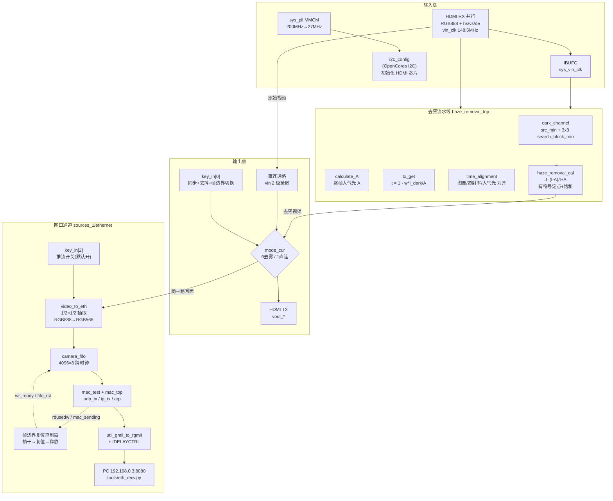

# hdmi_loop —— HDMI 实时暗通道去雾环出工程

## 一、项目简介

本项目在 Xilinx **Artix-7 xc7a200tfbg484-2**(ALINX AX7A200,Vivado 2021.2)上实现一条 **HDMI 输入 → 暗通道先验去雾 → HDMI 输出** 的实时视频环路,并**并行**地把同一路去雾画面经千兆网口推给 PC:

```
外部 HDMI 源 ──▶ HDMI 接收(RX,并行 RGB888 + HS/VS/DE)
              ──▶ 去雾流水线(Y_ENHANCE=0 默认链路)
              ──▶ key_in[0] 一键切换(去雾 / 直连)
              ├──▶ HDMI 发送(TX) ──▶ 显示器
              └──▶ key_in[2] 推流使能 ──▶ 1/2×1/2 抽取 + RGB565
                                        ──▶ camera_fifo ──▶ UDP/IP ──▶ RGMII PHY
                                        ──▶ 网线 ──▶ PC (tools/eth_recv.py)
```

- 输入/输出均为 **RGB888 并行 + 行场同步/DE**,像素时钟约 **148.5 MHz**(1080p60),顶层把有效行宽配置为 **1920 像素/行**;
- 输入时钟 `vin_clk` 经 IBUFG 得到 `sys_vin_clk`,整条去雾链与输出同步于该时钟;
- 板载按键 **key_in[0]** 可随时在“去雾”与“直连(原图)”之间切换,便于 A/B 对比;
- 板载按键 **key_in[2]** 开关网口推流(默认开),网口输出 **960×540 RGB565 @60fps**(约 62 MB/s);
- 去雾算法基于 **暗通道先验 Dark Channel Prior**(何恺明等,CVPR 2009)。

## 二、功能特性

| 特性           | 说明                                                                |
| -------------- | ------------------------------------------------------------------- |
| 实时去雾       | 全流水线,单个像素时钟处理 1 像素,不丢帧                             |
| 一键 A/B 对比  | key_in[0] 每按一次在 去雾/直连 间切换,默认去雾                      |
| 切换不撕裂     | 新模式只在帧边界(vsync 下降沿)生效                                  |
| 大气光逐帧更新 | A 按“最近一完整帧”统计并在帧边界锁存,场景变化可跟踪               |
| 定点实现       | 8 bit 像素,透射率/大气光 8 bit,内部有符号 18 bit 定点 + 0..255 饱和 |
| 可配置 Y 增强  | `Y_ENHANCE_ENABLE` 参数控制,YCbCr 亮度增强(默认关闭)              |
| 并行网口推流   | HDMI 环出不受影响;960×540 RGB565 @60fps,约 62 MB/s                 |
| 一键开关推流   | key_in[2] 开关(默认开),同样只在帧边界生效                           |
| 帧边界确定性   | FIFO 在每个 vsync 处“抽干→同步复位→释放”,每帧水平偏移恒为 0     |

## 三、算法原理

有雾成像模型:

```
I(x) = J(x)·t(x) + A·(1 − t(x))
```

- I(x):有雾观测图;J(x):待恢复清晰图;t(x):介质透射率;A:全局大气光。

去雾四步:

1. **暗通道** `I_dark(x)`:逐像素取 RGB 三通道最小值(`src_min`),再经 3×3 滑动窗口取最小值(`search_block_min`);
2. **大气光 A** `calculate_A`:统计一帧内“像素三通道最大值”的全局最大,作为大气光(单标量近似);
3. **透射率 t** `tx_get`:`t = 1 − ω·I_dark/A`,ω=0.95(定点 243/256);A 滞后当前帧约一帧;
4. **复原 J** `haze_removal_cal`:`J = (I − A)/max(t, t₀) + A`,t₀ = 26/256 透射率下限。

**定点实现与已修复的数值问题**

- `tx` 以 `tx/256` 表示,下限 `tx_min=26`(防止除零/过曝);
- 复原分子按有符号 18 bit 定点计算:`value_tem = (I−A)·256 + A·tx`。原代码用**无符号 8 bit 减法**求 `I−A`,凡 `I<A`(雾天绝大多数像素)都会回绕成大正数,约七成像素算错;现改为**有符号差分**后再取商;
- 除法结果必须 **0..255 饱和**(天空等亮区商可 >255,暗区可为负),原代码直接截断低 8 位,色彩错误;
- 大气光 A 现**逐帧重置累计**并加下界 1,避免跨帧漂移与全黑帧除零;透射率除法结果加 **0..255 钳位**,防止场景突变(dc>A)时无符号相减回绕。

## 四、系统架构



## 五、时钟与复位结构(顶层 hdmi_loop)

```text
sys_clk_p/n (R4, 200MHz 差分)
      │
 IBUFDS ┴ BUFG ──> sys_clk_200m ─┬─> sys_pll (PRIM_SOURCE=No_buffer) ──> 27MHz ──> i2c_config
                                 ├─> IDELAYCTRL.REFCLK  (rgmii_idelay_group)
                                 └─> reset(335ms) ──> phy_rst_n ──> e_reset(PHY)
                                                       └─ & IDELAYCTRL.RDY ──> 复位数同步(gmii_rx_clk) ──> eth_rst_n

vin_clk 148.5MHz ──> IBUFG ──> sys_vin_clk ──> 去雾链 / 直连延迟 / video_to_eth
```

- **200 MHz 差分** `sys_clk_p/n`(R4)现由顶层**显式** `IBUFDS + BUFG` 缓冲成 `sys_clk_200m`,同时供 `sys_pll`(MMCM,输出 27 MHz 给 I2C)和 `IDELAYCTRL`;
- **`sys_pll` 的 `PRIM_SOURCE` 必须改成 `No_buffer`**(见 [tools/setup_eth_ip.tcl](tools/setup_eth_ip.tcl))。原因:IDELAYCTRL 需要 200 MHz 参考,而板载唯一的 200 MHz 就是这对差分脚;一对时钟脚只能驱动**一个**输入缓冲,而 `sys_pll` 的生成 wrapper 内部已实例化了一个 IBUFDS,再挂一个会在 IO placer 阶段报 `[Place 30-602] IO port 'sys_clk_p' is driving multiple buffers`(无 XDC 属性可绕过)。改完后 `clk_in1` 变成普通输入,顶层把 BUFG 输出接进去。**改之前 `hdmi_loop.v` 无法 elaborate**(wrapper 仍暴露 `clk_in1_p/clk_in1_n`),所以必须先跑 Tcl 再综合;
- 也无法用 MMCM 再分频出 200 MHz 绕开:当前 VCO 742.5 MHz,742.5/200 不是整数;
- `locked` 作为全局复位 `rst_n`,并直接驱动三个 HDMI 芯片复位脚(`hdmi_nreset_v10 / hdmi_nreset / hdmi_in_nreset`);
- 输入视频时钟 `vin_clk`(约束 6.734 ns)经 `IBUFG` → `sys_vin_clk`;`vout_clk = sys_vin_clk`(输出跟随输入时钟,无需 TX 侧再锁相);
- `i2c_config_m0`(OpenCores I2C 主机,27 MHz 分频约 7 kHz SCL)上电初始化 HDMI RX/TX 芯片;
- **复位释放顺序**:`locked` → 335 ms 计数器(`reset.v`)→ `phy_rst_n` → `e_reset`;`eth_rst_n = phy_rst_n & locked & IDELAYCTRL.RDY` 经 `gmii_rx_clk` 域 3 级同步器释放。**刻意不从 `gmii_rx_clk` 派生复位再等 PHY**——PHY 复位期间可能不输出 RXC,会死锁。

## 六、按键模式切换逻辑(顶层新增)

- 极性:**按下 = 低**(key_in[0] 引脚 L19);
- 2 级触发器把按键同步到 `sys_vin_clk`;
- ~14.8 ms 稳定计数去抖(`KEY_STABLE=2_200_000 @148.5MHz`);
- 检测到去抖后的“1→0”按下沿 → 翻转请求模式 `mode_next`;
- 在 **vsync 下降沿(帧边界)** 才把 `mode_next` 落到生效寄存器 `mode_cur`;
- 输出 mux:`vout_* = mode_cur ? 直连(vin_* 2 级延迟) : 去雾(haze_*)`。

默认 `mode_cur=0` = 去雾。

**key_in[2] = 网口推流开关**([hdmi_loop.v](hdmi_loop.srcs/sources_1/new/hdmi_loop.v),引脚 K17):

- 与 key_in[0] 完全同构:2 级同步 + 14.8 ms 去抖 + 按下沿翻转 `push_req` + **帧边界**落到 `push_en`;
- `push_en` 初值 **1(默认开)**——按键未按下时 `key_in[2]=1`,去抖后电平为高,推流开启;
- `push_en` **只门控 FIFO 写使能**,不门控 FIFO 复位、也不门控行/帧计数器。否则关断期间 FIFO 里会残留半个帧,重新打开后 `mac_test` 会从残帧中间开始发包;
- 关断期间 HDMI 输出**完全不受影响**,`video_to_eth` 的列/行/帧计数继续跑,所以重新打开一定落在行边界上。

`key_in[1]` / `key_in[3]` 预留(已在 XDC 定义引脚,逻辑未使用)。

## 七、网口视频通道(960×540 RGB565 @60fps)

### 7.1 数据通路

```text
vout_* 复用后的画面(RGB888 @148.5MHz)
   └─> video_to_eth ── 1/2 列抽取 + 1/2 行抽取 → 960×540,RGB888→RGB565
                    └─ 每拍发 1 字节,保留行 = 1920 字节
   └─> camera_fifo(4096×8,跨时钟:写 148.5MHz / 读 125MHz)
   └─> mac_test → udp_tx(768 字节载荷,源端口 = 0x1000+行号)
                → ip_tx(IP ID = 行号)→ mac_tx
   └─> util_gmii_to_rgmii(ODDR/IDDR + IDELAY tap 30)→ RGMII PHY → 网线
```

- **带宽**:540 行 × 1920 字节 × 60 fps = **62.2 MB/s**;千兆线速扣除 Eth/IP/UDP 头约 **112~118 MB/s**,余量充足。
- **载荷长度 768 字节不是随便取的**:一帧 1,036,800 = **1350 × 768 整除**。原因见 7.2——MAC 只在攒够一个完整载荷时才发包,帧末尾不足一包的字节永远发不出去,只能被 FIFO 复位丢掉。载荷能整除帧长时,抽干正好落在 0,**一帧一个字节都不丢**。1024 除不尽(余 512);512 能整除但要 2025 个包、约 12.1 万包/秒,对收包 socket 压力大。768 → 1350 包/帧、约 8.1 万包/秒、链路效率 93%。
- **垂直抽取是承重设计**:若去掉行抽取,速率翻倍到 128 MB/s **超过线速**,4096 深的 FIFO 约 13 行就会写满。`video_to_eth.v` 顶部注释里写明了这条约束。
- **抽取起点由 `de` 间隙推导**,不依赖 `vin_hs`/`vin_vs` 的极性:行消隐 280 拍、场消隐约 99000 拍,`de` 连续为低 ≥1000 拍即判为场消隐。`de` 每个有效像素恰好一个脉冲,所以每行写脉冲数天然等于 1920,可用 ILA 直接核对。
- **只跨电平,不跨单拍脉冲**:6.734 ns 的单拍脉冲短于一个 125 MHz 周期,会被漏采。`eth_href`/`eth_vsync` 都是电平,进 `gmii_rx_clk` 域先过 2 级同步器。

### 7.2 帧边界确定性(参考工程最大缺陷,已重写)

参考工程(26_video_ethernet)用 `cmos_vsync` **异步复位 FIFO**,后果有两个:残余的不足一包的字节被静默丢弃,每帧水平偏移随机;若复位时 MAC 正在发包,读指针跳回 0 会让包中间混入垃圾字节。

本工程改为四态控制器(`eth_video_tx.v` 的 `F_IDLE→F_DRAIN→F_RESET→F_WAIT`):

1. 同步后的 vsync 上升沿 → 停写(`video_to_eth.wr_ready` 拉低);
2. **抽干**:等 `fifo_rdusedw < UDP_SEND_LEN` **且** `mac_sending == 0`(MAC 不在包中间);
3. 发 16 拍复位脉冲;
4. 等 `wr_rst_busy` / `rd_rst_busy` 都落下,才回到 IDLE 释放写使能。

第 2 步的条件**不是** `fifo_rdusedw == 0`,虽然那才是直觉写法。`mac_test` 只在攒够**一整包**时才起包,所以它停下来时 FIFO 里恒有 0~(UDP_SEND_LEN−1) 字节残料,计数永远回不到 0;写侧就永远等不到释放,整机变成"发完一帧就冻住"。判据写成"**残料已不足以再发一包**"既等价于"MAC 发不出下一个包",又一定终止(计数每包正好减 UDP_SEND_LEN)。

场消隐有 666 µs,FIFO 最多 4 KB,抽干远快于此。于是"**复位后第一个字节 = 帧的第一个字节**"由构造保证。

### 7.3 一并修掉的参考工程缺陷

| 位置                           | 问题                                                                                                                                             | 修法                                                                                               |
| ------------------------------ | ------------------------------------------------------------------------------------------------------------------------------------------------ | -------------------------------------------------------------------------------------------------- |
| `mac_test.v`                 | FIFO 阈值`>1000` **小于 1024 字节包长**,恰好 1001 时 `udp_tx` 越界读、包尾是垃圾                                                       | 改成由载荷长度派生:`fifo_rdusedw >= udp_send_data_length`,阈值再也不会和包长脱节                 |
| `mac_test.v`                 | `fifo_data_count` 声明 `[10:0]`,而 IP 的 `rd_data_count` 是 12 bit,高位被丢 → 计数 mod 2048 回绕后 MAC 停读、卡满 1 s 超时                | 全部加宽到`[11:0]`                                                                               |
| `udp_tx.v`                   | `udp_send_cnt < total_data_length - 3` 会发出 **载荷+1 次读使能**(1024 字节包下即 1025 次),每包多读 1 字节 → 每帧累计流错位约 1012 字节 | 改`- 4`;并用 3 包仿真证明:改前 3075 次读 / 3072 字节载荷里 2048 处错位,改后 3072 次读 / 0 处错位 |
| `util_gmii_to_rgmii` wrapper | IDELAYCTRL 的`RDY` 悬空、`RST` 接 0;若 200 MHz 未稳则 IDELAY 抽头未校准,RGMII 收不到包,ARP 永远失败且无任何可见原因                          | `RST` 接 `~locked`,**`RDY` 参与 `eth_rst_n` 释放条件**                               |
| FIFO`.full()` 悬空           | 无任何背压/丢弃统计                                                                                                                              | 接出到`fifo_full_dbg`                                                                            |

### 7.4 上位机

[video.exe](26_video_ethernet/) 写死 800×600,不兼容本工程的 960×540,因此自研 [tools/eth_recv.py](tools/eth_recv.py):

- UDP 目的端口 **8080**、源端口 **`0x1000 | (行号 & 0x3FF)`**,**载荷 768 字节**。行号实际是 **1~540**(注意**从 1 开始**,见下),所以线上看到的源端口是 **4097~4636**;掩码的作用是让源端口**永远不会跑出 `0x1000~0x13FF`**,于是"这是不是源端口版 bitstream"这个判断无法被误判。4640~5119 的源端口会被接收端**拒绝**——那只能是计数器跑飞后被掩码绕回来的结果,不是某一行;
- **行号是 1 基的,不是 0 基**。`identify_code` 在 vsync 沿清零,之后每来一个保留行的 href 下降沿 +1,于是 540 行拿到的是 **1~540**,**0 从未发过**。实机 32 万个包实测:源端口只出现 4097~4636,4096 一次都没有。这一点必须记住,否则接"合法行号是 0~539"去写接收端,就会把每一帧**末尾标号 540 的那 3 个包**(每帧 1350 个包,末标号占 3 个)当成非法丢掉,帧永远少 2304 字节、永远合不成——这正是本工程踩过的一个坑;
- 帧内的**标号是每包一个还是每行一个**也要注意:一行 1920 字节、一包 768 字节,**一行 = 2.5 个包**,所以标号在相邻包之间会**重复**(奇偶行分别是 3 个、2 个包),**只有"标号回退"才是帧边界**,数标号变化次数是错的;
- 一帧 1,036,800 字节 = **恰好 1350 个包**,帧正好落在包边界上(见 7.1 的载荷选择);
- 行号(`identify_code`:vsync 清零、每个保留行 +1,故为 **1~540**)**同时出现在两个地方**——IP 头的 Identification 字段,以及 UDP 源端口。帧内行号单调不减,**行号回退即帧边界**。用行号而不是数包,是为了丢包后能立刻重新对齐——数到 1350 一旦中途丢一个包就永久错位;
- 注意**一行跨 2.5 个包**(1920 ÷ 768),行号不是一包一变,而是连续若干包相同;只有**回退**才是帧边界;
- 两种读法对应 `--framing raw` 与 `--framing port`,默认 `auto` 自动探测;`auto` **不会静默降级**:需要 raw 而 raw 建不起来时直接报错退出;
- 源端口窗口 4097~4636 里,**4500 对应行号 404**,而 4500 是 Windows 的保留端口(IANA 分配给 IPsec NAT-T),本机**无法 bind**。这不影响本工程——发包方是 FPGA,PC 只 bind 8080,接收套接字接受任意源端口;但如果要在 PC 上模拟板子发包,需要避让这一条(自检脚本因此改用 `0x2000` 起始的窗口);
- 合成帧长度不等于 1,036,800 一律判丢包并丢弃(短帧解出来是明显的错行,会掩盖真正的问题);
- **逐项统计被拒原因**(长度不足 / 非 IPv4 / IHL 非法 / 协议非 UDP / 源 IP / 目的 IP / 目的端口 / UDP 长度 / 载荷长度 / 源端口落在窗口内但行号 > 540),接受率低于 50% 时打印明细并直接点出诊断;
- `--snapshot FILE`:存下第一帧完整画面(`.bin`/`.raw` 后缀存原始 RGB565,其余交 `cv2.imwrite`);`--duration SECS`:跑满指定秒数后自动退出,便于无人值守抓取;
- RGB565 → BGR 后 `cv2.imshow`,同时打印 fps / MB/s / 当前行号。

```bash
pip install numpy opencv-python
python tools/eth_recv.py                 # 实时显示(auto 探测定界方式)
python tools/eth_recv.py --framing port  # 指定用源端口读行号
python tools/eth_recv.py --framing raw   # 指定用 IP 头读行号(需管理员)
python tools/eth_recv.py --no-display    # 只统计,便于长时间跑
python tools/eth_recv.py --save out.avi  # 同时录制
```

**为什么原来必须用原始套接字,以及为什么最终改成源端口。** 行号最初只放在 IP 头里,
而 Linux/Windows 的 `recvfrom` 在普通 UDP 套接字上**只交付 UDP 载荷**,IP/UDP 头由内核剥掉;
要看见 IP 头必须开 `SOCK_RAW`。参考工程 `video.exe` 正是如此——它导入 `pcap_open_live` /
`pcap_next_ex` / `wpcap.dll`,是 **WinPcap 抓包**,不是 UDP 套接字。

代价是:Windows 创建 `SOCK_RAW` **必须管理员权限**;`bind` 只能绑具体本机 IP(`0.0.0.0` 报
`WSAEINVAL`);防火墙按应用放行,raw 套接字的 bind 不会自动建立入站放行规则,所以脚本额外绑了一个
**不读的普通 UDP 套接字**同时兼作"让 WFP 规则成立"和"避免内核回灌 8.1 万个 ICMP 端口不可达"。

把行号挪进**源端口**后,普通 UDP 套接字即可——`recvfrom` 返回的 `addr[1]` 就是行号,
不需要管理员、不需要解析包头(在 8.1 万包/秒下也便宜得多)、还免掉了防火墙这一环。
源端口不参与 IP 校验和的计算,所以改动对线上其余部分零影响。IP ID 里的行号**保留不动**,
两种读法因此可以互相校验。

#### 离线自检

```bash
python tools/tb_eth_recv.py   # 不插板子、不需要网卡、不需要管理员
```

共 87 项断言。用合成报文把两种定界各跑一遍,断言两边解析出的行号、载荷、帧边界完全一致、
**重组出的帧逐字节等于源数据**;断言丢一个包时该帧被判"短"并**不显示**、下一帧立刻恢复;
断言"**解析逻辑与套接字类型不匹配**"会被明确拒绝,而不是以 0.2% 的比例偷偷接受;
最后一项走**真实 UDP 套接字**(回环、1351 个包),端到端验证"源端口 → 行号 → 重组"这条链。

原始版本正是栽在后者:普通 UDP 套接字却按"缓冲区开头是 IP 头"解析,于是把两个像素字节当行号,
判掉 99.8% 的包却一路正常打印统计行——看起来像硬件故障,实际上是接收端自己的 bug。
这类"怎么开套接字"和"怎么解析字节"不匹配的错误,正是这个自检能提前抓住的。

> **接收端缓冲区**:约 8.1 万包/秒、62 MB/s 的小包流会瞬间打满默认 64 KB 的 socket 接收缓冲,内核静默丢包。脚本已把 `SO_RCVBUF` 顶到系统上限并打印实际拿到多少;仍见丢包时按脚本头部注释调大系统上限。

#### 能否用 PotPlayer / VLC / ffmpeg 收?

- **PotPlayer:不行。** 播放器打开的是文件与媒体流(http/rtsp/rtmp),没有"监听一个 UDP 端口、按私有格式重组"这种模式;
- **ffmpeg:可以**,因为它的 `udp://` 输入把数据报当**裸字节流**读,而本工程的输出恰好就是裸字节流:

  ```bash
  ffmpeg -f rawvideo -pixel_format rgb565be -video_size 960x540 -framerate 60 \
         -i "udp://0.0.0.0:8080?listen=1&overrun_nonfatal=1&fifo_size=20000000" \
         -f sdl "hdmi_loop"
  ```

  把 `-f sdl -` 换成输出文件名即可录制,加 `-c:v libx264 out.mp4` 可存成 mp4;
- **但 ffmpeg 没有任何丢包检测**:丢一个包,该帧后半段会整段错位却毫无提示。**需要确认画面可不可信时,用 `tools/eth_recv.py`**——它会打印丢帧数,并把长度不对的帧直接丢掉而不是显示出来。

### 7.5 上电与联调顺序

1. **PC 必须先配成 `192.168.0.3`**(或按需修改 `mac_test.v` 里的目的 IP)。固件侧目的 IP `192.168.0.3`、源 IP `192.168.0.2`、源 MAC `00:0a:35:01:fe:c0`、UDP 8080 全部写死,且 `arp_cache` **无老化**,配错只会每秒重发 ARP,永远不出图,且**只能复位 FPGA 恢复**。
2. 上板看:`locked` → `IDELAYCTRL.RDY` → PHY 链路灯 → ARP 成功(`u_mac_test/mac_not_exist` 拉低,建议挂 ILA)→ Wireshark 可见 8080 包 → `eth_recv.py` 出图。
3. **Wireshark 先确认线上是什么**(两分钟、零改动):过滤 `udp.port == 8080 && ip.src == 192.168.0.2`,期望包长 768 字节、约 81000 包/秒。再看行号在哪:新版 bitstream 的 `udp.srcport` 应在 4097~4636 之间随行号变化;若 `udp.srcport` 恒为 8080,则是改动前的 bitstream,用 `--framing raw`(管理员)。`ip.id` 在新旧版都应是 **1~540** 的单调爬升(1 基,见 7.4)。
4. ARP 一直失败时,优先查固定 `IDELAY_VALUE(30)` 是否匹配本板 RX 偏斜,以及 PC 的 IP。
5. 按 `key_in[2]`,确认关断期间不再发包、重新打开后画面完整无偏移。

**MDIO 全程不工作**(`e_mdc` 拉低、`e_mdio` 高阻),依赖 PHY 上电默认千兆全双工。

## 八、模块清单

| 模块                                    | 位置                      | 功能                                                                                   |
| --------------------------------------- | ------------------------- | -------------------------------------------------------------------------------------- |
| `hdmi_loop`                             | sources_1/new             | 顶层:时钟/复位/I2C/按键切换/输出去雾或直连/网口推流                                    |
| `haze_removal_top`                      | sources_1/darkchannel     | 去雾链顶层,generate 选择默认去雾或 Y 增强                                              |
| `dark_channel`                          | sources_1/darkchannel     | 暗通道顶层(src_min + search_block_min)                                                 |
| `src_min`                               | 同左                      | 逐像素 RGB 三通道最小值                                                                |
| `search_block_min`                      | 同左                      | 3×3 窗口最小值(4× sort3)                                                               |
| `matrix_generate_3x3`                   | 同左                      | 3×3 滑动窗口寄存器组                                                                   |
| `one_column_ram` / `fifo_ram`           | 同左                      | 两条 1920×8 行缓冲(推断为 2 个 Block RAM)                                              |
| `sort3`                                 | 同左                      | 3 个数排序(最大/中值/最小)                                                             |
| `calculate_A`                           | 同左                      | 大气光 A:逐帧最大值,帧边界锁存 + 下界 1                                                |
| `tx_get`                                | 同左                      | 透射率 t = 255 − 243·I_dark/A,结果 0..255 钳位;**除法已改为倒数查表乘**                |
| `time_alignment`                        | 同左                      | 对齐原始图像与 t/A(src 固定延迟**8** 拍,阶段 0 由 6 调整)                              |
| `haze_removal_cal`                      | 同左                      | 复原 J:有符号 18 bit 定点 + 0..255 饱和(默认非 IP 分支);**除法已改为倒数查表乘**       |
| `VIP_RGB888_YCbCr444` / `YCbCr2RGB`     | 同左                      | Y 增强休眠分支(Y_ENHANCE=1)用,默认不综合                                               |
| `sys_pll`                               | sources_1/ip              | MMCM 时钟 IP(`PRIM_SOURCE=No_buffer`)                                                  |
| `i2c_config` 等                         | sources_1/new             | OpenCores I2C 配置链                                                                   |
| `hdmi_loop.xdc`                         | constrs_1/new             | 管脚约束 + 时钟约束 + RGMII 段 + 时钟组                                                |
| `video_to_eth`                          | sources_1/ethernet        | **新增**:1/2×1/2 抽取、RGB888→RGB565、字节发射、行/帧计数                              |
| `eth_video_tx`                          | sources_1/ethernet        | **新增**:IDELAYCTRL + FIFO + MAC + RGMII + 帧边界复位控制器                            |
| `camera_fifo`                           | sources_1/ip              | **新增**:4096×8 独立时钟 FIFO(由 Tcl 生成)                                             |
| `mac_test` / `mac_top`                  | sources_1/ethernet/mac    | UDP/ARP/IP 收发状态机(**已修 3 处缺陷**)                                               |
| `udp_tx` / `ip_tx` / `mac_tx` 等        | sources_1/ethernet/mac/tx | 发送链;**`udp_tx` 已修 off-by-one**                                                    |
| `util_gmii_to_rgmii`                    | sources_1/ethernet        | RGMII↔GMII(ODDR/IDDR + IDELAYE2,固定 tap 30)                                           |
| `reset`                                 | sources_1/ethernet        | 335 ms 上电复位计数器                                                                  |
| `tools/setup_eth_ip.tcl`                | tools                     | **一次性工程改造脚本**(加源文件 / 改 PRIM_SOURCE / 建 FIFO)                            |
| `tools/eth_recv.py`                     | tools                     | **PC 端接收程序**(UDP 8080 → 960×540 显示,**双定界:raw / port**)                       |
| `tools/tb_eth_recv.py`                  | tools                     | `eth_recv` 离线自检(100 条断言,合成报文跑两种定界,不插板子)                            |
| `captures/frame.bin` / `frame.png`      | captures                  | 实机抓取的一帧原始 RGB565 与对应的可视 PNG(同一帧,回环转换位一致)                      |
| `captures/ten_seconds.avi`              | captures                  | 实机抓取的 10 秒视频(960×540 @60fps)                                                   |
| `tools/tb_video_to_eth.v`               | tools                     | `video_to_eth` 自检 testbench(缩放时序,已 PASS)                                        |
| `tools/tb_udp_tx_phase.v`               | tools                     | `udp_tx` 读使能数自检 testbench(3 包,已 PASS)                                          |

## 九、近期修复记录

1. **顶层多驱动清理**:删除残留的 `vin_*_d0/d1/d2` 直通与重复 `assign vout_clk`,`vout_*` 改由去雾模块唯一驱动(否则综合会把去雾当冗余剪掉或报多驱动)。
2. **复原算法修正**(haze_removal_cal):无符号回绕 → 有符号差分;结果加 0..255 饱和;累加器加宽到 18 bit。
3. **大气光逐帧重置**(calculate_A):A 不再向全局历史最大漂移;加下界 1 防除零。
4. **透射率稳健化**(tx_get):显式 16 bit 乘 243;除法商 0..255 钳位防场景突变回绕。
5. **按键去雾/直连切换**(hdmi_loop):见第六节。
6. **组合除法 → 倒数查表乘**(本次,阶段 0 前置修复):见第十节。这是**功能性 bug 而非"slack 不好看"**。
7. **网口视频通道**(本次):见第七节,含参考工程 5 处缺陷修复。
8. **帧边界控制器死锁 + 载荷长度改为 768**(本次自审发现):
   - `F_DRAIN` 原写 `fifo_rdusedw == 0 && !mac_sending`。但 `mac_test` 只在攒够一整包时才起包,停下时 FIFO 恒有 0~767 字节残料,计数永远回不到 0 → 写侧永不释放,**发完一帧就冻住**。改为 `fifo_rdusedw < UDP_SEND_LEN && !mac_sending`;
   - 载荷 1024 → **768**:一帧 1,036,800 字节,**1024 除不尽(余 512)**,帧尾余数永远攒不成一包、只能被 FIFO 复位丢掉;768 整除(1350 包),抽干正好落在 0,一帧不丢一个字节。同时把 `mac_test` 的 FIFO 阈值由魔数改成从载荷长度派生 `>= udp_send_data_length`,从根上消除"阈值 < 包长"这类缺陷。
9. **上位机一帧都合不出来:套接字类型与解析逻辑不匹配**(本次,见 7.4):
   - 现象:`dropped` 每 2 个包涨 1、`0.00 MB/s`、0 fps、"行号"在 12000~19000 之间乱跳,但脚本一路正常打印统计行;
   - 根因:`eth_recv.py` 开的是**普通 UDP 套接字**,却按"缓冲区开头就是 IP 头"解析。`recvfrom` 在 `SOCK_DGRAM` 上只交付 UDP 载荷,于是 `buf[0] >> 4` 是像素、`buf[4..5]` 是像素——两个像素字节被当成"行号"。仍有约 0.2% 的包靠巧合通过校验(6% × 1%),所以脚本看起来"在工作"。参考工程 `video.exe` 是 WinPcap 抓包,能看见 IP 头,该约定本来是给它用的;
   - 修法:`mac_test.v` 把行号同时写进 **UDP 源端口**(`0x1000 + 行号`,目的端口仍是 8080),接收端用 `recvfrom` 返回的 `addr[1]` 直接读行号,无需管理员、无需解析包头;IP ID 里的行号**保留不动**,`--framing raw` 仍可用,两种读法互为交叉校验;
   - 同时给接收端补上:**分步拒绝计数 + 低接受率告警**(不再"高高兴兴地拒掉 99.8%")、**源 IP / 目的 IP / 目的端口 / IP 协议校验**(raw 套接字会收到该 IP 上所有 IPv4 报文,Windows 下 `IPPROTO_UDP` 并**不**过滤)、**`MAX_CUR` 上限**(行号若恒不回退,原逻辑会以 62 MB/s 撑爆内存)、**帧号在 UDP 头里的稳定性**(`identify_code_d0` 只在 `CHECK_FIFO` 锁存,整包期间恒定);
   - 新增 `tools/tb_eth_recv.py`:不插板子即可跑,断言两种定界解析一致、且上述不匹配会被**明确拒绝**。本次自检本身就抓出了两个真实问题(raw 路径漏查 IP 协议字段;以及帧内行号"一行跨 2.5 包"的模型)。
10. **行号是 1 基的,接收端按 0 基设卡导致再次一帧不合**(本次,实机联调):
   - 现象:接受率 **99.8%**、62 MB/s、8.1 万包/秒,但 **10 秒 0 帧**,每帧恒短 **2304 字节(= 3 个包)**,且帧边界总是报在 "line 1";
   - 根因:上一轮为防止"计数器跑飞被掩码绕回"加了一道 `line >= 540 即拒绝` 的卡。但实机 `identify_code` 是 **1 基**的(vsync 清零后第一个 href 下降沿就 +1),540 行拿到的是 **1~540**,**0 从未出现**。于是每帧末尾标号 540 的那 3 个包被当成非法丢掉,帧只剩 1347 个包 = 1,034,496 字节,与实测数字逐字节吻合;下一帧的首包标号 1 < 539,边界就报在 "line 1";
   - **诊断手段**:直接对源端口做直方图(4 秒 32 万包),发现**只出现 4097~4636、4096 一次都没有**、4636 却是常客——一行数据就定位了。比对着日志猜快得多;
   - 修法:卡改成 `line > 540`(接受 0~540 全区间,行号只作**排序提示**、不作行索引),自检的合成模型同步改成 1 基(`packet_line(i) = 2i//5 + 1`)并新增两条断言:标号 540 **必须被接受**、标号 0 也容许;
   - 教训:**"合法值域"要从硬件实测反推,不能从文档假设**;而自检模型一旦和硬件不一致,它就会一路绿灯地把你送进坑里。
   - 实机验证:修复后 10 秒收到 **595 帧、59.5 fps、100% 接受、62 MB/s**,`captures/frame.png` 颜色正常、无错行。

以上改动均通过 `xvlog` 语法检查 + `xelab` 全量 elabor(0 ERROR);综合/实现由开发者在 Vivado GUI 执行。

## 十、阶段 0:148.5 MHz 时序修复(必须最先做)

`hdmi_loop.runs/impl_1/hdmi_loop_timing_summary_routed.rpt` 显示 `vin_clk` 域 **WNS = −25.527 ns / 72 个失败端点**,最差路径是
`u_haze_removal_top/u_haze_removal_cal/value_tem_r_reg[0]/C → post_img_b_reg[3]/D`,
即 `haze_removal_cal.v` 里的**组合 18÷8 除法**。这不是"slack 不好看",而是**蓝色通道的商本身就算错**。

两处组合除法改为 **256 项倒数查表 + 乘法**,不引入新 IP、延迟确定:

| 文件                                                                         | 原式                                                | 现式                                                                    |
| ---------------------------------------------------------------------------- | --------------------------------------------------- | ----------------------------------------------------------------------- |
| [haze_removal_cal.v](hdmi_loop.srcs/sources_1/darkchannel/haze_removal_cal.v) | `q = value_tem_r / $signed({10'b0, tx_value_d1})` | `q = (value_tem_r * recip[tx_value_d1]) >>> 16`(有符号 30 bit 积)     |
| [tx_get.v](hdmi_loop.srcs/sources_1/darkchannel/tx_get.v)                     | `tx_q = modify_A / A_value_d1`                    | `tx_q = (tx_prod_r + 28'd32768) >> 16`(12 bit 查表 + 寄存器化 DSP 乘) |

- `recip[v] = round(65536 / v)`,即 `(65536 + (v>>1)) / v`,v=0 取 0;除数实际范围 26..255;
- `recip[v<26]` 镜像 `v=26`(tx_get 里为 `12'd2521`),与原来的透射率下限 `tx_min=26` 一致;
- **`time_alignment.v` 的 `src_delay` 由 6 改为 8**,补偿 `tx_get` 多出的 2 拍;两模块内部的控制流水线也相应加长(`d1..d3`),否则控制与数据错位;
- 综合为 1~2 个 DSP48,饱和逻辑(0..255)与所有已有数值修正**保持不变**。

**验收**:Run Implementation 后 `vin_clk` 域 **0 失败端点**,且失败列表中不再出现 `value_tem_*_reg` / `post_img_*_reg` 路径。

## 十一、已知限制与注意事项

- **`sys_pll` 必须先生成**:顶层改成 `.clk_in1(sys_clk_200m)` 后,若没先跑 [tools/setup_eth_ip.tcl](tools/setup_eth_ip.tcl) 把 `PRIM_SOURCE` 改成 `No_buffer` 并重新生成 IP,**elaborate 会直接失败**(wrapper 仍暴露 `clk_in1_p/clk_in1_n`)。这是本工程的第一个强制步骤。
- **垂直抽取不可去掉**:去掉行抽取会让网口速率翻倍到 128 MB/s,超过千兆线速,FIFO 约 13 行就写满。详见 7.1。
- **PC 必须处于 192.168.0.3 网段**:无 MDIO、无 ARP 老化,配错只能复位 FPGA 恢复。
- **固定 IDELAY tap 30 不自校准**:若本板 RX 偏斜不匹配,ARP 会一直失败。这是上板联调第一个要查的点。
- **RGMII 的 IO 延迟是估值**:XDC 里 `set_input_delay` / `set_output_delay` 的数值建模的是板级/PHY 偏斜,**不是硅片要求**,故意取宽。有 PHY datasheet 的真实 setup/hold 再替换,不要为了"时序过"去收紧。
- **休眠分支未启用且未维护**:`Y_ENHANCE_ENABLE=1`(Y 增强,含 Cb/Cr 交换、`+50` 无钳位、输出位序等已知缺陷)与 `Xilinx_IP` 分支(引用未建入工程的 div_gen IP)默认不参与综合,启用前需先修复。
- **3×3 块最小近似**:暗通道窗口以“底行锚定”方式生成,透射率图相对原图约有一行 + 1~2 像素的固有偏移;行缓冲不跨帧复位,每帧顶部约 2 行/左右边缘像素的暗通道会混入相邻行,视觉影响通常很小。
- **大气光为单标量近似**:取全帧通道最大值(而非 He 原论文 top-0.1% 亮像素),对含大面积白物体的场景估计会偏亮,属可接受的硬件简化。
- **按键在 sys_vin_clk 域工作**:无 HDMI 输入时钟时按键无效(此时亦无画面,网口也一样)。

## 十二、验证流程(开发者在 Vivado GUI 执行)

### 第 0 步(强制,只做一次)

```tcl
# 打开 hdmi_loop.xpr,在 Tcl 控制台执行:
source tools/setup_eth_ip.tcl
```

它会:把 `sources_1/ethernet/` 下 22 个 .v 加入工程 → 把 `sys_pll` 改成 `PRIM_SOURCE=No_buffer` 并重新生成 → 新建 `camera_fifo`。**不要把 26_video_ethernet 的 `.xci` 拷过来**——那是 2023.1.1 写的、`gen_directory` 指向不存在的路径,打开会触发 IP 升级,可能改掉 `wr_rst_busy/rd_rst_busy` 复位结构。

### 第 1 步:综合

Run Synthesis → 期望 **0 ERROR、无 multiple driver**;Utilization 里 **Block RAM > 0**(两条 1920×8 行缓冲 + camera_fifo),**DSP48 > 0**(倒数查表乘)。

### 第 2 步:实现

Run Implementation → **先按名字审失败端点列表,不要只看 WNS 数字**(阶段 0 修完前 WNS 会被除法路径主导):

- `vin_clk` 域 0 失败端点;
- 无 `[Place 30-602] IO port 'sys_clk_p' is driving multiple buffers`;
- 无 `IBUFCTRL unplaced`;
- `rgmii_rxc` 自成一个时钟组。

### 第 3 步:生成比特流

Write Bitstream → 烧录(SPIx4)。

### 第 4 步:上板

1. HDMI 环出:接入有雾 HDMI 源 → 默认去雾输出清晰;按一次 key_in[0] 切到**直连原图**,再按回**去雾**;确认无整帧黑、无错误偏色、切换瞬间不撕裂。
2. 网口:**先把 PC 配成 `192.168.0.3`(在 FPGA 上电之前)**,再跑 `python tools/eth_recv.py` → 期望 60 fps 稳定出图,`dropped` 保持 0。若不出图,按 7.5 的顺序逐级排查,而不是反复重跑接收脚本。
3. 推流开关:按 `key_in[2]`,确认关断期间不再发包、重新打开后画面完整、无水平偏移。

### 已完成的离线验证(不依赖上板)

- `tools/tb_video_to_eth.v`:缩放几何自检,48/48 写、6/6 行、每行写数 min=max=8、0 字节错位、奇数行/奇数列正确丢弃 → **PASS**;
- `tools/tb_udp_tx_phase.v`:3 包无错位自检,`-4` 时 3072 次读 / 0 处错位(PASS),`-3` 时 3075 次读 / 3072 字节里 2048 处错位(FAIL,反证修复有效);
- 全量 `xvlog` + `xelab`(含 unisims)→ **0 ERROR**。
